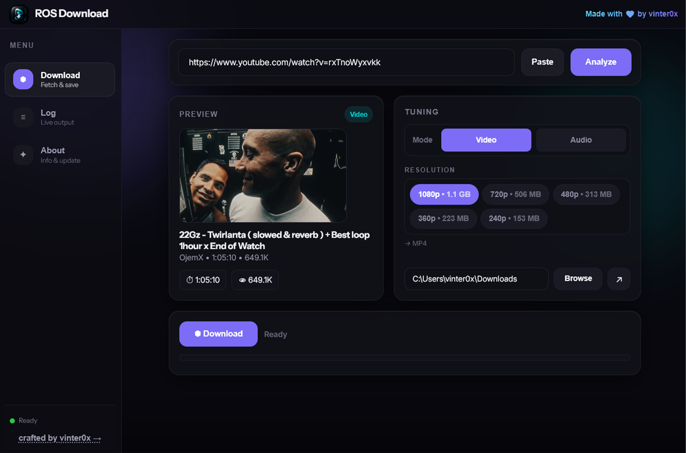

<div align="center">

# ROS Download

### A clean, fast desktop downloader for video & audio.

Download media from platforms like **YouTube**, **SoundCloud**, and more — with a focused interface designed to keep the workflow simple:

**Paste → Analyze → Choose → Download**

<br>



---

## ✦ What is ROS Download?

**ROS Download** is a desktop media downloader built around one idea: **make downloading feel effortless.**

Instead of navigating through cluttered download sites, ROS gives you a compact workspace where you can paste a link, inspect the media, select the format or quality you want, and save it directly to your chosen folder.

It is designed for people who want a downloader that feels more like a real desktop application than a web utility.

---

## ✨ Features

| | Feature | Description |
|---|---|---|
| 🔗 | **Smart URL input** | Paste a supported media URL and analyze it in one click. |
| 🎬 | **Video downloads** | Choose from available video resolutions and save as MP4. |
| 🎵 | **Audio downloads** | Switch to audio mode for audio-focused downloads. |
| 👀 | **Media preview** | See the title, thumbnail, duration, channel/author and other available metadata before downloading. |
| ⚙️ | **Quality selection** | Pick the resolution that fits your needs and connection. |
| 📁 | **Custom output folder** | Choose exactly where downloaded files should be saved. |
| 📋 | **Download log** | Keep track of download activity and output. |
| 🚀 | **Focused workflow** | No unnecessary pages, popups or complicated settings. |
| 🌙 | **Dark interface** | A modern dark UI designed for long sessions and clear visual hierarchy. |

---

## 🎯 Supported Platforms

ROS Download is intended to work with popular media platforms, including:

- **YouTube**
- **SoundCloud (Soon...)**
- Other supported sources as the downloader evolves

> Platform support depends on the underlying extraction/download capabilities and may change as third-party services update their systems.

---

## 🖥️ Interface

The application is organized around a small number of focused areas:

### Download

The main workspace.

1. Paste a media URL.
2. Click **Analyze**.
3. Review the detected media.
4. Select **Video** or **Audio**.
5. Choose the available quality/format.
6. Select an output location.
7. Download.

### Preview

Before downloading, ROS can present the available media information so you know exactly what you are about to save.

### Log

A dedicated place for download/output activity, useful when managing multiple downloads.

### About

Project information, version details and application credits.

---

## ⚡ Design Philosophy

ROS Download intentionally follows a **less-is-more** approach.

### One primary action

The interface should make the next step obvious.

### Information before download

Analyze the media first, then choose what to download.

### Desktop-first

The application is designed around local files, folders and a native desktop workflow rather than a browser-based download experience.

### No visual noise

Dark surfaces, restrained accents and clear hierarchy keep the interface focused on the media itself.

---

## 🧩 Typical Workflow

```text
┌──────────────┐
│ Paste URL    │
└──────┬───────┘
       │
       ▼
┌──────────────┐
│   Analyze    │
└──────┬───────┘
       │
       ▼
┌──────────────┐
│ Media Info   │
│ + Preview    │
└──────┬───────┘
       │
       ▼
┌────────────────────┐
│ Video    │  Audio  │
└─────────┬──────────┘
          │
          ▼
┌────────────────────┐
│ Quality / Format   │
└─────────┬──────────┘
          │
          ▼
┌────────────────────┐
│ Output Folder      │
└─────────┬──────────┘
          │
          ▼
┌──────────────┐
│   Download   │
└──────────────┘
```

---

## 🛠️ Development

ROS Download is structured as a desktop application with a strong emphasis on:

- clean UI
- predictable download flows
- clear separation between analysis and downloading
- local file handling
- readable logs
- maintainable platform integrations

If you are contributing, keep changes focused and avoid adding complexity where a simpler implementation works.

---

## 📌 Roadmap

Potential areas for future development:

- [ ] Playlist / batch downloads
- [ ] Download queue
- [ ] Pause / resume support
- [ ] More media platforms
- [ ] More audio formats
- [ ] Download history
- [ ] Filename templates
- [ ] Metadata embedding
- [ ] Improved progress reporting
- [ ] Automatic update system
- [ ] Portable build

---

## ⚠️ Responsible Use

ROS Download is a tool for downloading media from supported online platforms.

**Only download content when you have the right or permission to do so.** Respect copyright, licensing restrictions, privacy, and the terms of service of the platforms you use.

The availability of a downloader does not grant permission to download or redistribute copyrighted material.

---

## 🤝 Contributing

Contributions, bug reports and ideas are welcome.

A good contribution should:

1. Solve a concrete problem.
2. Keep the UI simple.
3. Avoid unnecessary dependencies or abstraction.
4. Preserve existing functionality.
5. Include clear reproduction steps when fixing a bug.

---

## 📄 License

Add the project's license here.

For example:

```text
MIT License
```

if the repository is released under MIT.

---

<div align="center">

### ROS Download

**Simple. Fast. Focused.**

Made with ❤️ by **vinter0x**

</div>
