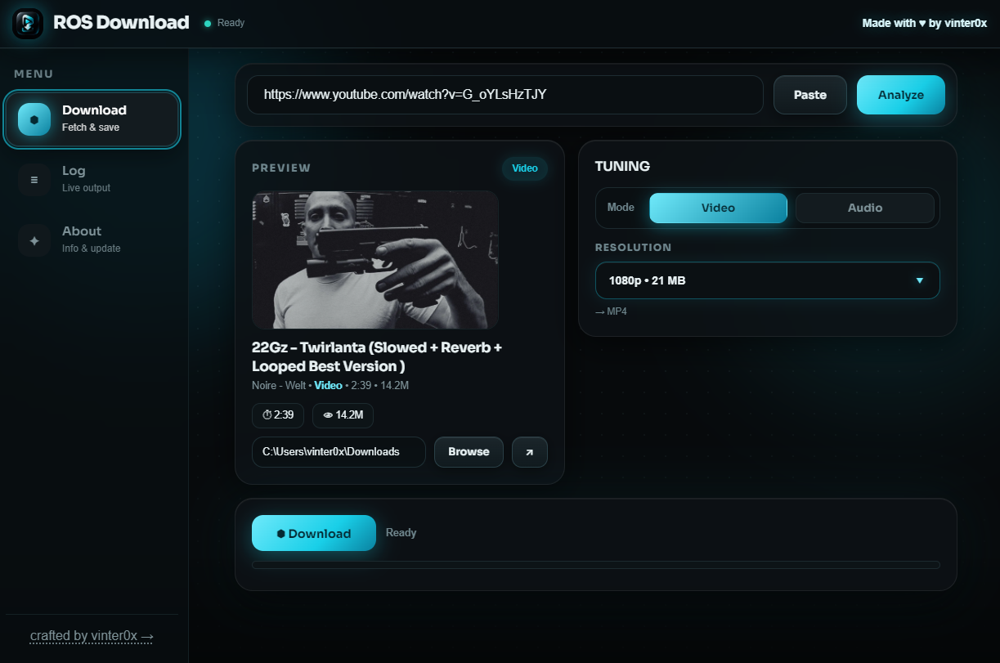

<!DOCTYPE html>
<html lang="en">
<head>
<meta charset="UTF-8">
</head>
<body>

  

    <h1>ROS Download</h1>
    
    

  

  <h2>✦ What is this? 🤔</h2>
  
<b>ROS Download</b> is a desktop media downloader with one religion: <b>downloading should feel effortless.</b> No browser converter mazes 🌀, no "click here 5 times" nonsense 🚫 — a compact dark workspace where you paste a link, peep the preview 👀, pick your poison ☠️, and save it straight to your folder. 📁

  <h2>✦ Heat list 🔥🎵</h2>
  <table>
    <tr><th></th><th>FEATURE</th><th>WHAT IT DO</th></tr>
    <tr><td>🔗</td><td><b>Smart URL input</b></td><td>Paste anything — video, track, set, artist page — one click analyzes it.</td></tr>
    <tr><td>🎬</td><td><b>Video → MP4</b></td><td>4K down to 240p, every size labeled before you commit. No surprises.</td></tr>
    <tr><td>🎵</td><td><b>Audio → MP3</b></td><td>Best / 320k / 256k / 192k / 128k. Drill hits different in 320k. 🥁</td></tr>
    <tr><td>🎧</td><td><b>YouTube Music smarts</b></td><td>Music links auto-detected as <i>Music</i> 🎶 — tracks, playlists/albums AND artist pages, locked to audio-only like SoundCloud.</td></tr>
    <tr><td>🟠</td><td><b>SoundCloud full support</b></td><td>Tracks, sets, full artist pages, playlists with custom ranges (1-3,5 📝).</td></tr>
    <tr><td>👀</td><td><b>Live preview</b></td><td>Thumbnail, title, duration, views, uploader — know exactly what you keepin'.</td></tr>
    <tr><td>⏸️</td><td><b>Pause / Resume / Cancel</b></td><td>Real control mid-download. Big files? Pause it, live your life. ✌️</td></tr>
    <tr><td>🍪</td><td><b>Cookies — stay logged in</b></td><td>Import <code>cookies.txt</code> for age-restricted / private / members-only vids. 🔓</td></tr>
    <tr><td>⬆️</td><td><b>Self-updater</b></td><td>One tap: downloads, swaps the build, reopens fresh. You won't lift a finger. ☝️</td></tr>
    <tr><td>📋</td><td><b>Live log</b></td><td>Every yt-dlp whisper, timestamped. Nerds welcome. 🤓</td></tr>
    <tr><td>🌙</td><td><b>Obsidian-cyan UI</b></td><td>Dark glass, glowing accents, pop-in animations. Built for 3AM sessions. 🦉</td></tr>
  </table>

  <h2>✦ The ritual 🕯️</h2>
  <ul>
    <li>1️⃣ <b>Paste</b> the link 🔗</li>
    <li>2️⃣ Hit <b>Analyze</b> 🔍 <i>(stuck? 90s timeout + cancel got you 🛟)</i></li>
    <li>3️⃣ Peep the <b>Preview</b> 👀 — "yep, that's the one" ✅</li>
    <li>4️⃣ Pick <b>Video 🎬 or Audio 🎵</b> + quality from the glass drop-down 🎚️</li>
    <li>5️⃣ Smash <b>⬢ Download</b> 💥 → watch the bar fill 🟦 → file lands in your folder 📂</li>
  </ul>

  <h2>✦ Where it eats 🍽️</h2>
  <ul>
    <li>🔴 <b>YouTube</b> — videos, playlists, ranges</li>
    <li>🎶 <b>YouTube Music</b> — tracks, albums/playlists, artist pages (audio-only, auto-detected 🧠)</li>
    <li>🟠 <b>SoundCloud</b> — tracks, sets, full artist discographies</li>
  </ul>
  
<i>Support rides on yt-dlp + ffmpeg under the hood — if they can see it, ROS can save it. 👁️</i>

  <h2>✦ Get it 📦⬇️</h2>
  <ul>
    <li>🪟 <b>Windows:</b> <code>ROS.Download-Setup-v1.2.0.exe</code> (installer) or the <code>Portable.exe</code> — no install, just run 🏃</li>
    <li>🐧 <b>Linux:</b> <code>sudo apt install ./ROS.Download*.deb</code> / <code>sudo dnf install</code> / AUR <code>makepkg -si</code> (yt-dlp + ffmpeg come as distro deps 🤝)</li>
    <li>🤖 <b>Android:</b> <code>adb install ROS.Download.apk</code></li>
  </ul>
  
First launch auto-fetches <b>yt-dlp + ffmpeg</b> if missing (hit <b>Fix</b> 🔧 if it asks) — Linux pulls them from your package manager instead. 📥

  <h2>✦ Under the hood ⚙️</h2>
  <ul>
    <li>🦀 <b>Rust (Tauri)</b> — yt-dlp/ffmpeg orchestration, cookies, updater, auto-setup</li>
    <li>💜 <b>Kotlin Multiplatform + Compose</b> — one UI, desktop / Android / web-Tauri</li>
    <li>🎨 <b>Hand-rolled glass UI</b> — no component-library lookalikes here 🚫</li>
  </ul>

  
⚠️ <b>Heads up, fam:</b> download only what you have the right to keep. Artists eat off streams 🍽️🎤 — support the ones you loop. Twirlanta on repeat counts as emotional support. 🖤

  

    
🌃 <i>paste it. loop it. keep it.</i> 🔁

    
Made with ❤️‍🔥 by <b>vinter0x</b> — <i>crafted, not generated</i> ✨

  

</body>
</html>
